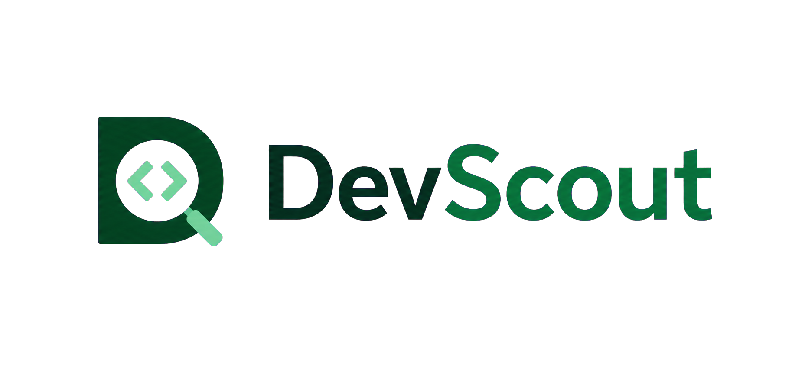

<p align="center">
  
</p>

<p align="center">
  Descubra, avalie e acompanhe talentos de desenvolvimento em um único workspace.
</p>

# DevScout

O DevScout é uma plataforma de recrutamento técnico integrada ao GitHub. A aplicação ajuda equipes a encontrar desenvolvedores, analisar sinais públicos de experiência, comparar perfis e acompanhar candidatos durante todo o processo seletivo.

## Funcionalidades

- Descoberta de desenvolvedores por usuário, linguagem, localização, repositórios e estrelas.
- Sincronização de perfis e repositórios públicos pela API do GitHub.
- Score técnico com dimensões de impacto, qualidade, consistência, profundidade e colaboração.
- Comparação de candidatos lado a lado.
- Pipeline visual de recrutamento com múltiplas etapas.
- Notas, tags, favoritos e histórico de scores.
- Gestão de equipe com papéis e acesso inicial por senha temporária.
- Isolamento de dados por organização.
- Registro de auditoria das ações relevantes do workspace.

## Stack

- PHP 8.5 e Laravel 13
- Inertia.js 3, React 19 e TypeScript
- Tailwind CSS 4
- PostgreSQL 18
- Pest 4
- Laravel Sail

## Requisitos

- Docker com Docker Compose
- Composer, necessário apenas para preparar o Laravel Sail em uma instalação nova
- Token pessoal do GitHub recomendado para ampliar o limite de requisições da API

## Instalação

Clone o repositório e acesse a pasta do projeto:

```bash
git clone <url-do-repositorio> dev-scout
cd dev-scout
```

Instale as dependências PHP caso a pasta `vendor` ainda não exista:

```bash
composer install
```

Prepare o ambiente:

```bash
cp .env.example .env
vendor/bin/sail up -d
vendor/bin/sail artisan key:generate
```

Para usar o PostgreSQL disponibilizado pelo Sail, configure estas variáveis no `.env`:

```dotenv
APP_NAME=DevScout
APP_URL=http://localhost

DB_CONNECTION=pgsql
DB_HOST=pgsql
DB_PORT=5432
DB_DATABASE=devscout
DB_USERNAME=sail
DB_PASSWORD=password

GITHUB_TOKEN=
```

Depois, crie o banco e compile o frontend:

```bash
vendor/bin/sail artisan migrate
vendor/bin/sail npm install
vendor/bin/sail npm run build
```

A aplicação estará disponível em [http://localhost](http://localhost).

## Desenvolvimento

Mantenha os containers ativos e execute o Vite em modo de desenvolvimento:

```bash
vendor/bin/sail up -d
vendor/bin/sail npm run dev
```

O token definido em `GITHUB_TOKEN` é enviado apenas para a API do GitHub. Sem ele, a integração continua funcionando, mas fica sujeita ao limite reduzido para requisições anônimas.

## Como utilizar a aplicação

Consulte o [guia de uso do DevScout](docs/guia-de-uso.md) para acompanhar o fluxo completo, desde a criação do workspace até a gestão do pipeline, da equipe e da auditoria.

Para entender as camadas, fluxos internos e responsabilidades de cada classe, consulte a [documentação de arquitetura](docs/arquitetura.md).

## Qualidade e testes

```bash
# Testes automatizados
vendor/bin/sail artisan test --compact

# Análise de tipos do frontend
vendor/bin/sail npm run typecheck

# Lint do frontend
vendor/bin/sail npm run lint

# Formatação do PHP
vendor/bin/sail bin pint --format agent

# Build de produção
vendor/bin/sail npm run build
```

## Estrutura principal

```text
app/
├── Integrations/GitHub/     Cliente e normalização da API do GitHub
├── Services/                Casos de uso e regras de negócio
├── Repositories/            Acesso aos dados da aplicação
└── Support/Tenancy/         Contexto da organização ativa

resources/js/
├── components/              Componentes compartilhados
└── pages/                   Páginas React renderizadas pelo Inertia

tests/
├── Feature/                 Fluxos da aplicação
└── Unit/                    Regras isoladas
```

## Identidade visual

Os arquivos da marca estão disponíveis em [`public/brand`](public/brand):

- `devscout-logo.png`: assinatura horizontal.
- `devscout-icon.png`: ícone da aplicação e favicon.

## Licença

Este projeto é distribuído sob a licença MIT.
